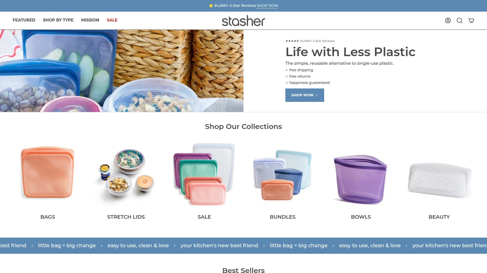
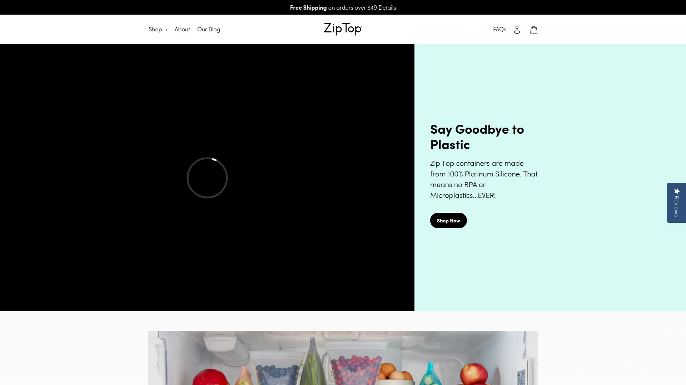
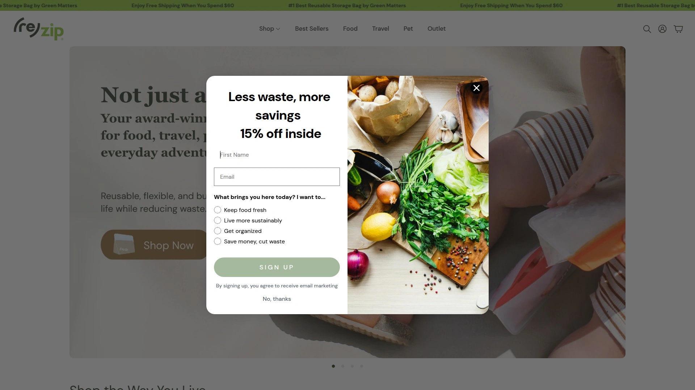
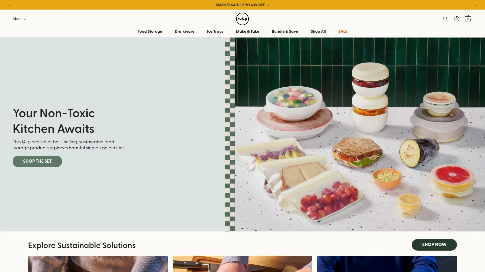
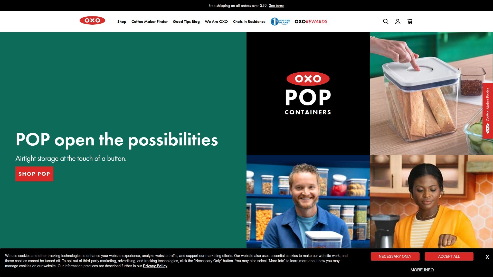
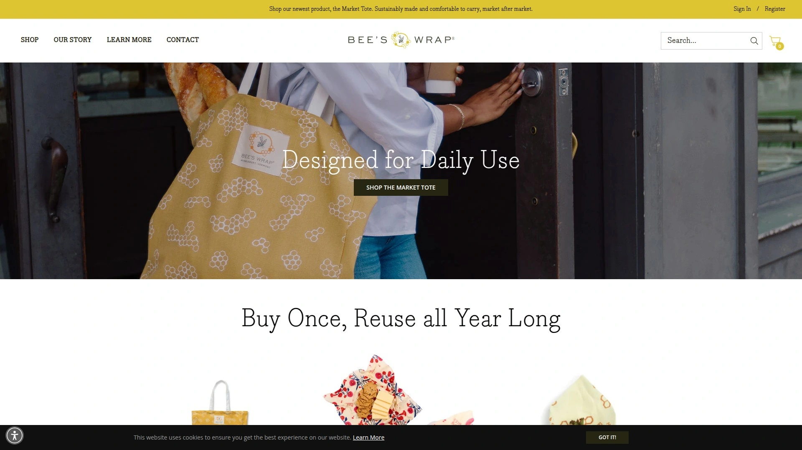
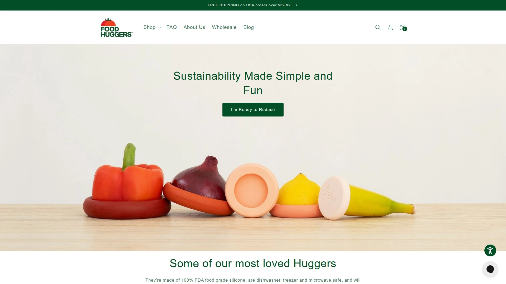
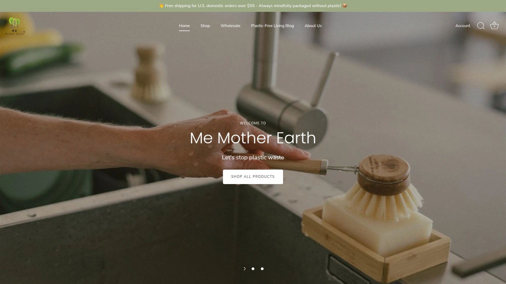
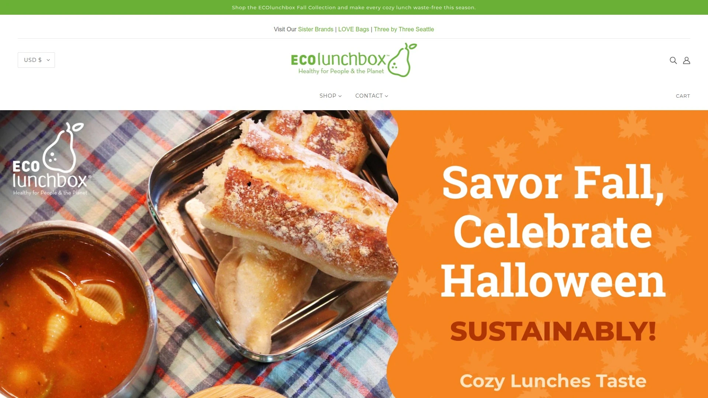
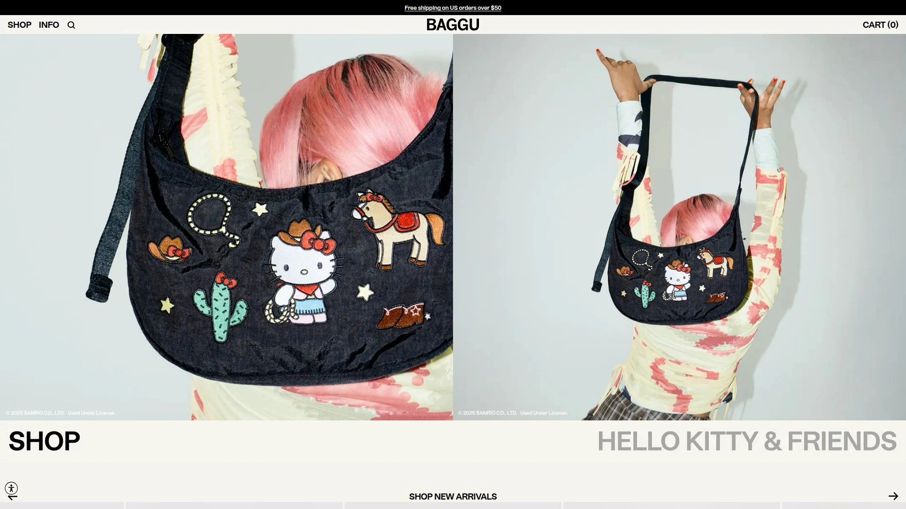

# 再也不用一次性塑料袋污染环境了！推荐10款环保可重复使用硅胶袋的神器！

在快节奏的现代生活中，许多人面临食品储物时的一次性塑料浪费问题，使用可重复使用硅胶袋能有效解决这一痛点。这些产品适用于厨房储物、零废弃生活和外出携带场景，帮助用户减少塑料使用、保持食物新鲜。通过选择合适的环保食品储物袋，你可以获得更稳定的密封效果、更低的长期成本和更广的适用范围，实现可持续生活方式。

## [Stasher](https://www.stasherbag.com)
食品级硅胶制成的可重复使用储物袋，适合零废弃厨房场景。

Stasher袋采用铂金硅胶材质，确保耐用和安全，可用于微波炉、洗碗机、冰箱和烤箱（最高425°F）。核心功能包括防漏Pinch-Loc密封，防止食物泄露，适用于零食、沙拉和剩饭储物。针对环保用户，产品帮助每年减少数百个塑料袋进入海洋，支持Terracycle回收计划。入门简单，只需手洗或机洗即可，定价从10美元起，推荐因为其多功能性和长寿命，能显著降低日常成本。

## [Zip Top](https://ziptop.com)
自立式硅胶容器，理想于餐前准备和外出携带。

产品线包括杯子、碗和袋子，全硅胶设计无BPA，可微波加热和冷冻存储。特点是自立底座，便于填充和存放，密封紧实防溢漏。适合忙碌上班族或家庭，场景如打包午餐或存储汤汁。优势在于易清洁，一体成型无死角，用户反馈入门门槛低，只需几秒钟打开关闭。价格中等，起步约15美元一套，值得推荐因其创新形状提升使用便利性。

## [Rezip](https://rezip.com)
耐用平面储物袋，专注于减少废物和组织生活。

 (re)zip袋使用食品级材料，支持洗碗机清洗，密封设计确保气密性。列表形式核心功能：防漏边缘、透明视窗、多种尺寸选择。适用场景包括旅行打包和厨房整理，针对追求简单生活的用户。技术优势是轻薄便携，区别于传统塑料。用户体验顺畅，快速上手无难度，定价亲民从8美元起。推荐理由是其多功能，帮助用户实现高效储物并支持可持续目标。

## [W&P](https://wandp.com)
时尚硅胶食品容器，强调设计与实用结合。

W&P Porter系列包括袋子和碗，材质安全可微波。特点混用段落和列表：耐热至425°F；易于折叠存储；色彩多样提升心情。目标用户为都市年轻群体，场景如办公室午餐或野餐。区别点是美观设计，融入现代生活。入门容易，清洗便捷，价格约20美元，推荐因为它平衡了美学和功能，提高日常储物乐趣。

## [OXO](https://www.oxo.com)
多功能厨房工具品牌，提供硅胶储物解决方案。

OXO硅胶袋结合人体工程学设计，易握开合。核心特点：防滑纹理、透明材质便于查看内容、可堆叠存储。适用于家庭烹饪和食物准备，针对忙碌父母。优势在于品牌可靠性和耐用性，用户反馈上手快。定价合理从12美元起，推荐因其全面厨房兼容性，优化储物效率和成本控制。

## [Bee's Wrap](https://www.beeswrap.com)
蜂蜡硅胶混合包装，适合自然环保爱好者。

产品融合蜂蜡和硅胶，提供可重复使用覆盖。功能包括包裹食物、覆盖碗口，保持新鲜。场景：存储奶酪或蔬菜，推广零废弃。优势是可生物降解，区别于纯硅胶。用户体验温和，用手温暖塑形，入门需实践。价格从10美元，推荐因为其有机成分，支持可持续生活并降低塑料依赖。

## [Food Huggers](https://foodhuggers.com)
硅胶食物抱抱器和袋子，专注新鲜保持。

Hugger袋100%铂金硅胶，BPA免费，可洗碗机安全。列表功能：紧贴密封、防潮保鲜、多尺寸适应。针对剩食存储用户，场景如冰箱整理。技术点是弹性设计，易于使用无学习曲线。定价经济约15美元一套，推荐因其针对性强，帮助延长食物寿命并节约开支。

## [Me Mother Earth](https://memotherearthbrand.com)
生态友好储物系列，促进塑料-free生活。

产品包括硅胶袋和其他可持续用品，强调环保。核心优势：耐用材料、易清洁、多种套装选择。适用家庭和旅行，目标零废弃实践者。用户反馈入门简单，价格从8美元，推荐因为全面生态承诺，提升储物稳定性和覆盖范围。

## [ECOlunchbox](https://ecolunchboxes.com)
不锈钢与硅胶结合的午餐盒系统，注重便携。

结合硅胶盖的容器，防漏密封。功能混用：可微波硅胶部分、耐冲击钢体。场景外出午餐或学校使用，针对儿童和成人。优势是耐用混合材质，用户上手快。定价中等约25美元，推荐因其安全性和多场景适应，控制成本有效。

## [Baggu](https://baggu.com)
轻便可重复使用袋子，融入日常携带。

Baggu硅胶和织物混合，折叠便携。特点：大容量、防撕裂、时尚图案。适用于购物和储物，目标都市消费者。区别点是可机洗，入门零门槛。价格低从10美元，推荐因为其便利性和风格多样，助力可持续习惯。

## 常见问题
**可重复使用硅胶袋支持哪些场景？**
这些袋子适用于厨房储物、外出午餐和旅行打包，能保持食物新鲜并防漏，建议根据尺寸选择以匹配需求。

**如何快速入门使用这些产品？**
大多数产品只需简单清洗后即可使用，注意遵循微波或冷冻指南，通常几分钟内就能上手并评估密封效果。

**如何评估这些硅胶袋的效果？**
通过测试保鲜时间和防漏性能来评估，优质产品能延长食物寿命1-2倍，并提供更低的长期成本计算。

在2025年，这些可重复使用硅胶袋汇总帮助你实现环保转型，提供高效储物选择。为什么[Stasher](https://www.stasherbag.com)适合厨房零废弃场景，因为其耐用密封和多功能性突出。立即挑选一款，开始可持续生活！
